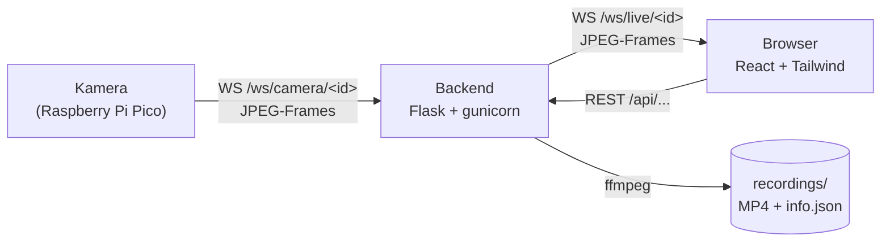

# Videoüberwachtes Vogelhaus

Ein Vogelhaus mit eingebauter Kamera, die zeigt, wer am Futterplatz vorbeischaut. Im Vogelhaus sitzt ein Raspberry Pi Pico 2 W mit einer Arducam Mega. Er schickt JPEG-Bilder per WebSocket an einen kleinen Server, der die Bilder im Browser live anzeigt und auf Knopfdruck als MP4 aufzeichnet.

Das Projekt ist als Semesterprojekt an der DHBW entstanden.


## Woraus das System besteht

Im Vogelhaus selbst steckt ein Raspberry Pi Pico 2 W mit einer Arducam Mega 3MP, per SPI verbunden und in einem 3D-gedruckten Gehäuse untergebracht. Die Firmware dafür liegt in [`pico-code/main.py`](pico-code/main.py), sie verbindet sich mit dem WLAN und streamt mit 10 Bildern pro Sekunde.

Auf der anderen Seite läuft ein Flask-Backend, das die Bilder entgegennimmt, an alle verbundenen Browser weiterreicht und Aufnahmen mit ffmpeg als MP4 auf die Platte schreibt. Es läuft zusammen mit nginx als Docker-Stack auf jedem Linux-Rechner. Im Browser zeigt eine React-Oberfläche alle Kameras als Kacheln, mit einer Detailseite pro Kamera für Livebild, Aufnahmeknopf und die Liste der bisherigen Videos.

## Funktionen

- Mehrere Kameras gleichzeitig. Eine Kamera meldet sich an, indem sie sich verbindet, es gibt keine Registrierung und keine Konfigurationsdatei.
- Livebild im Browser, dazu pro Kamera der Status: online oder offline, gemessene Bildrate, Auflösung und letzte Sichtung.
- Aufnahme per Klick. Encodiert wird auf dem Server mit ffmpeg.
- Aufnahmen lassen sich benennen, abspielen, herunterladen und löschen.
- Von jeder Kamera wird ein Standbild gespeichert, damit offline Kameras nicht als leere Kachel dastehen.
- Name, Standort und Beschreibung können pro Kamera hinterlegt werden.
- Hell- und Dunkelmodus, richtet sich standardmäßig nach den Systemeinstellungen und lässt sich in der Oberfläche umschalten.


## Schnellstart mit Docker

```bash
git clone https://github.com/Geocrack/Videoueberwachtes-Vogelhaus.git
cd Videoueberwachtes-Vogelhaus
```

```bash
docker compose up -d --build --wait
```

Die Oberfläche läuft danach unter <http://localhost:8080>. Solange keine Kamera verbunden ist, bleibt die Seite leer. Am schnellsten kommt ein Bild mit der [Testkamera ohne Hardware](#testkamera-ohne-hardware). Eine echte Kamera wird unter [Kamera anschließen](#kamera-anschließen) eingerichtet.


## Entwicklung ohne Docker

Gebraucht werden Python 3.12, Node 24 oder neuer und `ffmpeg` im `PATH`. Ohne ffmpeg funktioniert alles außer den Aufnahmen.

Backend im ersten Terminal:

```bash
cd backend
python -m venv .venv
source .venv/bin/activate
pip install -r requirements.txt
python app.py
```

Frontend im zweiten Terminal:

```bash
cd frontend
npm install
npm run dev
```

### Testkamera ohne Hardware

```bash
cd backend
python tests/testscript_raspberry_pi_camera.py
```

Das Skript meldet drei Fake-Kameras (`vogelhaus-0/1/2`) mit generierten Frames am lokalen Backend an. Ein wanderndes Rechteck im Bild macht sichtbar, ob der Stream läuft oder hängt. Für einen Test gegen einen anderen Server wird `BACKEND_URL` im Skript umgestellt.

### Tests

Die Tests des Backends laufen mit pytest und brauchen ffmpeg:

```bash
cd backend
pytest
```

## Kamera anschließen

### Raspberry Pi Pico mit Arducam

Gebraucht werden ein Raspberry Pi Pico 2 W, eine Arducam Mega 3MP (SPI-Variante) und sechs Kabel. Die Verkabelung steht am Anfang von [`pico-code/main.py`](pico-code/main.py). Bauteile, Aufbau und Inbetriebnahme im Detail beschreibt die [Hardware-Dokumentation](docs/hardware/Hardware-Dokumentation.pdf), die CAD-Modelle für Vogelhaus und Pico-Gehäuse liegen in [`docs/hardware/cad/`](docs/hardware/cad/) als Fusion-Datei und 3MF.

Die Inbetriebnahme läuft so ab:

1. MicroPython für den Pico 2 W auf den Pico flashen.
2. Den Arducam-Treiber `camera.py` von Core Electronics ([CE-Arducam-MicroPython](https://github.com/CoreElectronics/CE-Arducam-MicroPython)) auf den Pico kopieren.
3. In `pico-code/main.py` den Block `Konfiguration` anpassen: `WLAN_SSID` und `WLAN_PASSWORT`, dazu `WS_URL` mit der Adresse des Servers und `GERAETENAME` als Kamera-ID. Die ID am Ende von `WS_URL` muss mit `GERAETENAME` übereinstimmen.
4. `main.py` auf den Pico kopieren. Beim nächsten Einschalten startet der Stream von selbst.

Die LED zeigt an, was der Pico gerade tut. Schnelles Blinken heißt WLAN-Verbindung, ein kurzer Blitz alle zwei Sekunden heißt Stream läuft, ein Doppelblitz pro Sekunde heißt Fehler mit Neuversuch. Die vollständige Liste steht in der Firmware.

Nach dem Start ist ein Watchdog aktiv, der die REPL nach acht Sekunden abbricht. Um an den Pico zu kommen, entweder in den ersten Sekunden nach dem Einschalten, wenn die LED langsam blinkt, BOOTSEL drücken, oder im laufenden Betrieb BOOTSEL etwa zwei Sekunden halten. Der Pico startet dann ohne Stream und mit dauerhaft leuchtender LED.

### Eigene Kamera anschließen

Für eine eigene Kamera reicht es, eine WebSocket-Verbindung zu öffnen und darüber die Bilder zu senden:

```
ws://localhost:5000/ws/camera/<kamera-id>        # lokal, Backend direkt
ws://localhost:8080/ws/camera/<kamera-id>        # lokal, über nginx
```

- `<kamera-id>`: frei wählbar, erlaubt sind nur `A-Z a-z 0-9 _ -`, zum Beispiel `vogelhaus-0`. Die Kamera erscheint danach von selbst in der UI.
- Format: pro Frame eine binäre WebSocket-Nachricht, die genau eine vollständige JPEG-Datei enthält. Kein Base64, kein JSON, kein eigener Header, nicht über mehrere Nachrichten verteilt.
- Bildrate: etwa 10 Frames pro Sekunde, also alle 100 ms einen. Aufnahmen werden mit 10 fps encodiert, bei anderen Raten laufen die MP4s zu schnell oder zu langsam.
- Timeout: mindestens ein Frame alle 15 Sekunden, sonst gilt die Kamera als offline.
- Auflösung: beliebig, sie wird aus dem ersten Frame übernommen, zum Beispiel 320×240.
- Ausrichtung: das Backend dreht jedes Bild um 180 Grad, weil die Kamera im Vogelhaus über Kopf hängt. Eine Kamera, die richtig herum montiert ist, muss ihre Bilder also selbst gedreht schicken.
- Textnachrichten auf derselben Verbindung landen nur als Statusmeldung im Log des Backends. Praktisch für Debug-Ausgaben.

### Optionale Metadaten

Name, Standort und Beschreibung landen als `info.json` im Ordner der Kamera:

```bash
curl -X PUT http://localhost:5000/api/cameras/vogelhaus-0/info -H "Content-Type: application/json" -d "{\"name\":\"Garten\",\"location\":\"Apfelbaum\"}"
```

Alle weiteren Endpunkte stehen in [docs/api.md](docs/api.md).

## Architektur



Kameras senden ihre Frames an `/ws/camera/<id>`, Browser holen sich dieselben Frames von `/ws/live/<id>`. Jeder eingehende Frame wird sofort an alle Zuschauer dieser Kamera weitergereicht und zusätzlich auf die Platte geschrieben, solange eine Aufnahme läuft.

Unter Docker sitzt nginx davor und liefert UI, `/api` und `/ws` gemeinsam auf Port 8080 aus. Ohne Docker macht das der Vite-Devserver auf Port 5173.

Das Backend läuft mit genau einem gunicorn-Worker, und das muss auch so bleiben. Der Zustand der Verbindungen und laufenden Aufnahmen liegt im Prozessspeicher. Bei mehreren Workern landen Kamera und Zuschauer in verschiedenen Prozessen und finden sich nicht mehr.

## Deployment

Ein Push auf `main` löst den Workflow in [`.github/workflows/deploy.yml`](.github/workflows/deploy.yml) aus. Er lässt zuerst die Backend-Tests auf einem GitHub-Runner laufen und baut danach den Docker-Stack auf einem self-hosted Runner neu. Änderungen, die nur Markdown-Dateien betreffen, lösen kein Deployment aus.

Wie ein frischer Linux-Server dafür eingerichtet wird, inklusive Runner und Cloudflare Tunnel für den Zugriff von außen, steht in [docs/server-setup.md](docs/server-setup.md).

## Konfiguration

Das Backend liest die folgenden Umgebungsvariablen. Welche davon im Container gesetzt sind, steht in [`docker-compose.yml`](docker-compose.yml). Alle Zeiten sind Sekunden.

| Variable                 | Standard             | Bedeutung                                              |
|--------------------------|----------------------|--------------------------------------------------------|
| `RECORDINGS_DIR`         | `backend/recordings` | Ordner für Aufnahmen, Standbilder und Metadaten        |
| `MAX_RECORDING_SECONDS`  | `1800`               | danach endet eine Aufnahme automatisch                 |
| `MAX_RECORDING_FRAMES`   | `20000`              | dasselbe, bezogen auf die Anzahl Frames                |
| `MIN_FREE_DISK_MB`       | `2000`               | so viel Speicher muss für eine neue Aufnahme frei sein |
| `ONLINE_TIMEOUT_SECONDS` | `15`                 | ohne Frame in dieser Zeit gilt eine Kamera als offline |
| `WATCHDOG_INTERVAL`      | `10`                 | wie oft nach überfälligen Aufnahmen gesehen wird       |
| `STATE_WRITE_INTERVAL`   | `30`                 | wie oft der Kamerazustand gespeichert wird             |
| `POSTER_WRITE_INTERVAL`  | `60`                 | wie oft das Standbild erneuert wird                    |

Ports:

| Port | Dienst                                                                                              |
|------|-----------------------------------------------------------------------------------------------------|
| 8080 | Frontend (nginx), leitet `/api`, `/ws` und `/health` weiter. Das ist der Port für Browser und Kameras. |
| 5000 | Backend direkt (Flask/gunicorn), unter Docker nur zum Debuggen nötig                                 |
| 5173 | Vite-Devserver, nur ohne Docker                                                                      |

## Aufbau des Repos

```
backend/            Flask-App, WebSockets, Aufnahmelogik, Tests und die Testkamera
frontend/           React-App mit Vite, Tailwind und daisyUI, dazu die nginx-Konfiguration
pico-code/          MicroPython für den Raspberry Pi Pico 2 W mit Arducam Mega
docs/               API, Server-Anleitung, Screenshots, Hardware-Dokumentation als PDF und CAD-Modelle
.github/workflows/  Tests und Deployment bei Push auf main
docker-compose.yml  Frontend und Backend für lokalen Start und Deployment
```
