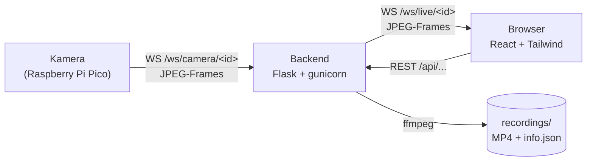

# Videoüberwachtes Vogelhaus

Kameras am Vogelhaus schicken JPEG-Frames per WebSocket an ein Flask-Backend. Das React-Frontend
zeigt die Bilder live an und kann sie  als MP4 aufzeichnen.


## Funktionen

- Mehrere Kameras gleichzeitig. Eine Kamera meldet sich an, indem sie sich verbindet, es gibt keine Registrierung und keine Konfigurationsdatei.
- Livebild im Browser, dazu pro Kamera der Status: online oder offline, gemessene Bildrate, Auflösung und letzte Sichtung.
- Aufnahme per Klick. Encodiert wird auf dem Server mit ffmpeg.
- Aufnahmen lassen sich benennen, abspielen, herunterladen und löschen.
- Von jeder Kamera wird ein Standbild gespeichert, damit offline Kameras nicht als leere Kachel dastehen.
- Name, Standort und Beschreibung können pro Kamera hinterlegt werden.


## Architektur



Es gibt zwei Arten von WebSocket-Verbindungen. Kameras senden ihre Frames an `/ws/camera/<id>`,
Browser holen sich dieselben Frames von `/ws/live/<id>`. Jeder eingehende Frame wird sofort an alle
Zuschauer dieser Kamera weitergereicht und zusätzlich auf die Platte geschrieben, solange eine
Aufnahme läuft.

Unter Docker sitzt nginx davor und liefert UI, `/api` und `/ws` gemeinsam auf Port 8080 aus. Ohne
Docker macht das der Vite-Devserver auf Port 5173.

Das Backend läuft mit genau einem gunicorn-Worker, und das muss auch so bleiben. Der Zustand der
Verbindungen und laufenden Aufnahmen liegt im Prozessspeicher. Bei mehreren Workern landen Kamera
und Zuschauer in verschiedenen Prozessen und finden sich nicht mehr.

## Start mit Docker

```bash
docker compose up -d --build --wait
```

```bash
docker compose logs -f backend
```

```bash
docker compose down
```

UI unter <http://localhost:8080>, das Backend direkt unter <http://localhost:5000>.

Ohne `--build` startet Compose das zuletzt gebaute Image weiter und Codeänderungen tauchen nicht
auf. Die Aufnahmen liegen im Volume `recordings` und überstehen `docker compose down`. Erst
`down -v` löscht sie.

## Entwicklung ohne Docker

Gebraucht werden Python 3.12, Node 24 oder neuer und `ffmpeg` im `PATH`. Ohne ffmpeg funktioniert
alles außer den Aufnahmen.

Backend im ersten Terminal:

```bash
cd backend
python -m venv .venv
source .venv/bin/activate
pip install -r requirements.txt
python app.py
```

Unter Windows wird die Umgebung mit `.venv\Scripts\Activate.ps1` aktiviert. Das Backend hört danach
auf <http://localhost:5000>.

Frontend im zweiten Terminal:

```bash
cd frontend
npm install
npm run dev
```

Der Vite-Devserver leitet `/api` und `/ws` an `localhost:5000` weiter, bedient wird die Anwendung
also über <http://localhost:5173>.


### Testkamera ohne Hardware

```bash
cd backend
python tests/testscript_raspberry_pi_camera.py
```

Das Skript meldet drei Fake-Kameras (`vogelhaus-0/1/2`) mit generierten Frames am lokalen Backend
an. Für einen Test gegen die Produktion muss `BACKEND_URL` im Skript umgestellt werden.

## Kamera anschließen (Raspberry Pi Pico)

Eine WebSocket-Verbindung öffnen und darüber die Bilder senden:

```
ws://localhost:5000/ws/camera/<kamera-id>        # lokal, Backend direkt
ws://localhost:8080/ws/camera/<kamera-id>        # lokal, über nginx
```

- `<kamera-id>`: frei wählbar, erlaubt sind nur `A-Z a-z 0-9 _ -`, zum Beispiel `vogelhaus-0`. Die Kamera erscheint danach von selbst in der UI.
- Format: pro Frame eine binäre WebSocket-Nachricht, die genau eine vollständige JPEG-Datei enthält. Kein Base64, kein JSON, kein eigener Header, nicht über mehrere Nachrichten verteilt.
- Textnachrichten auf derselben Verbindung landen nur als Statusmeldung im Log. Praktisch für Debug-Ausgaben.
- Bildrate: etwa 5 Frames pro Sekunde, also alle 200 ms einen. Aufnahmen werden mit 5 fps encodiert, bei anderen Raten laufen die MP4s zu schnell oder zu langsam.
- Timeout: mindestens ein Frame alle 15 Sekunden, sonst gilt die Kamera als offline.
- Auflösung: beliebig, sie wird aus dem ersten Frame übernommen, zum Beispiel 320×240.

### Optionale Metadaten

Name, Standort und Beschreibung landen als `info.json` im Ordner der Kamera:

```bash
curl -X PUT http://localhost:5000/api/cameras/vogelhaus-0/info -H "Content-Type: application/json" -d "{\"name\":\"Garten\",\"location\":\"Apfelbaum\"}"
```

## API

Die Antworten sind JSON, außer bei Bildern und Videos. `<id>` ist die Kamera-ID, `<video>` der
Dateiname einer Aufnahme ohne `.mp4`.

| Methode  | Pfad                                    | Zweck                                                    |
|----------|-----------------------------------------|----------------------------------------------------------|
| `GET`    | `/health`                               | Healthcheck für Docker und Deployment                    |
| `GET`    | `/api/cameras`                          | Alle Kameras mit Status, Bildrate und Anzahl der Videos  |
| `PUT`    | `/api/cameras/<id>/info`                | Name, Standort und Beschreibung setzen                   |
| `GET`    | `/api/cameras/<id>/poster.jpg`          | Letztes Standbild                                        |
| `POST`   | `/api/cameras/<id>/recording/start`     | Aufnahme starten, `409` läuft schon, `507` Platte voll   |
| `POST`   | `/api/cameras/<id>/recording/stop`      | Aufnahme beenden und als MP4 encodieren                  |
| `GET`    | `/api/cameras/<id>/videos`              | Aufnahmen mit Titel, Größe und Datum                     |
| `GET`    | `/api/cameras/<id>/videos/<video>.mp4`  | Video abspielen oder herunterladen                       |
| `PUT`    | `/api/cameras/<id>/videos/<video>/name` | Video umbenennen                                         |
| `DELETE` | `/api/cameras/<id>/videos/<video>`      | Video löschen                                            |

Dazu die beiden WebSockets `/ws/camera/<id>` und `/ws/live/<id>`.

## Konfiguration

Das Backend liest die folgenden Umgebungsvariablen. Welche davon im Container gesetzt sind, steht in
[`docker-compose.yml`](docker-compose.yml).

| Variable                 | Standard             | Bedeutung                                             |
|--------------------------|----------------------|-------------------------------------------------------|
| `RECORDINGS_DIR`         | `backend/recordings` | Ordner für Aufnahmen, Standbilder und Metadaten        |
| `MAX_RECORDING_SECONDS`  | `1800`               | danach endet eine Aufnahme automatisch                 |
| `MAX_RECORDING_FRAMES`   | `20000`              | dasselbe, bezogen auf die Anzahl Frames                |
| `MIN_FREE_DISK_MB`       | `2000`               | so viel Speicher muss für eine neue Aufnahme frei sein |
| `ONLINE_TIMEOUT_SECONDS` | `15`                 | ohne Frame in dieser Zeit gilt eine Kamera als offline |
| `WATCHDOG_INTERVAL`      | `10`                 | wie oft nach überfälligen Aufnahmen gesehen wird       |
| `STATE_WRITE_INTERVAL`   | `30`                 | wie oft der Kamerazustand gespeichert wird             |
| `POSTER_WRITE_INTERVAL`  | `60`                 | wie oft das Standbild erneuert wird                    |
| `LOG_LEVEL`              | `INFO`               | Log-Level, zum Beispiel `DEBUG`                        |

## Ports

| Port | Dienst                                            |
|------|---------------------------------------------------|
| 8080 | Frontend (nginx), leitet `/api`, `/ws`, `/health` weiter |
| 5000 | Backend (Flask/gunicorn)                          |
| 5173 | Vite-Devserver, nur ohne Docker                   |

## Deployment

Ein Push auf `main` stößt [`.github/workflows/deploy.yml`](.github/workflows/deploy.yml) an. Zuerst
laufen die Tests auf einem GitHub-Runner, danach baut ein self-hosted Runner die Images neu und
startet den Stack mit `docker compose up -d --build --force-recreate --wait`. Änderungen, die nur
Dokumentation betreffen, lösen kein Deployment aus.

## Aufbau des Repos

```
backend/            Flask-App, WebSockets, Aufnahmelogik, Tests
frontend/           React-App mit Vite, Tailwind und daisyUI, dazu die nginx-Konfiguration
docker-compose.yml  Frontend und Backend für lokalen Start und Deployment
```
